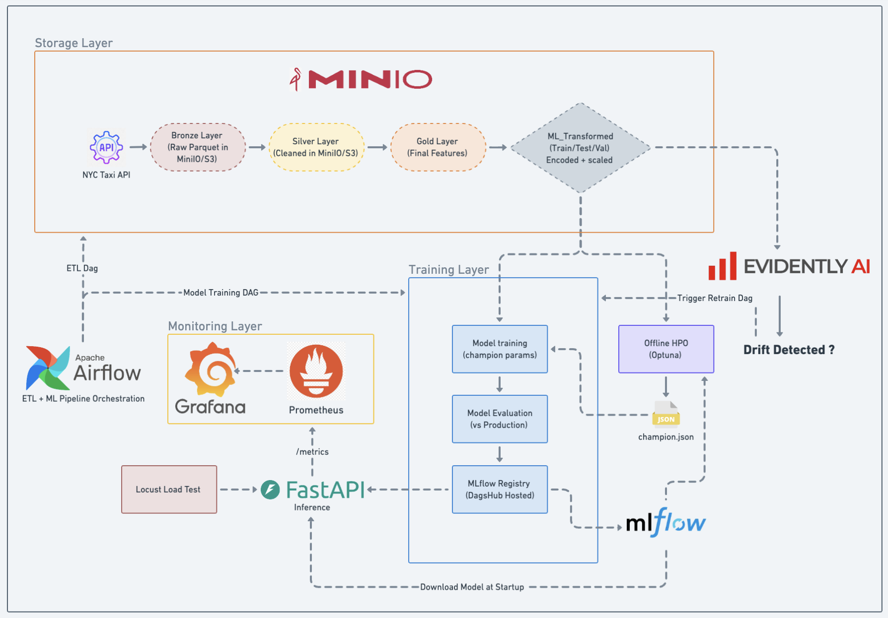

# NYC Yellow Taxi MLOps Pipeline

An end-to-end ML system that predicts NYC yellow taxi trip durations. Covers the full lifecycle: data ingestion, feature engineering, model training, experiment tracking, real-time inference, monitoring, and automated retraining when data changes.

---

## Architecture



---

## What It Does

1. **Ingests** raw NYC taxi trip data monthly from the TLC website
2. **Cleans and transforms** the data through Bronze, Silver, and Gold layers stored in MinIO
3. **Trains** a machine learning model using the best hyperparameters found via Optuna
4. **Evaluates** the new model against the current production model and only promotes if it's better
5. **Serves predictions** via a FastAPI inference API with a web UI
6. **Monitors** prediction metrics and system health via Prometheus and Grafana
7. **Detects drift** monthly and automatically triggers retraining if the data distribution has changed

---

## Services

| Service | URL | Credentials |
|---------|-----|-------------|
| Airflow | http://localhost:8080 | airflow / airflow |
| Inference API + Web UI | http://localhost:8000 | - |
| Grafana | http://localhost:3000 | admin / admin |
| Prometheus | http://localhost:9090 | - |
| Locust (load testing) | http://localhost:8089 | - |
| MinIO (object storage) | http://localhost:9001 | minioadmin / minioadmin |

---

## Quick Start

### Prerequisites

- Docker and Docker Compose
- A [DagShub](https://dagshub.com) account with an access token (for MLflow tracking)

### 1. Clone and configure

```bash
git clone <repo-url>
cd NYC-YELLOW-TAXI-MLOPS
cp env.example .env
```

Edit `.env` and set your DagShub token:

```
DAGSHUB_TOKEN=your_token_here
```

### 2. Build and start

```bash
docker compose build
docker compose up airflow-init   # first time only
docker compose up -d
```

### 3. Run the data pipeline

Open http://localhost:8080, enable and trigger the `nyc_taxi_mlops_pipeline` DAG.

This runs the full pipeline: data ingestion -> feature engineering -> model training -> model registry.

### 4. Make a prediction

```bash
curl -X POST http://localhost:8000/predict \
  -H "Content-Type: application/json" \
  -d '{
    "pickup_datetime": "2025-06-15T14:30:00",
    "PULocationID": 161,
    "DOLocationID": 237,
    "trip_distance": 3.5
  }'
```

Or open http://localhost:8000 for the web UI.

**Response:**

```json
{
  "predicted_duration_minutes": 17.23,
  "model_family": "random_forest",
  "model_version": "v9"
}
```

---

## Airflow DAGs

| DAG | Schedule | What it does |
|-----|----------|-------------|
| `nyc_taxi_mlops_pipeline` | Monthly | Full pipeline: ETL + train + evaluate + register |
| `nyc_data_refresh_dag` | Monthly | ETL + drift detection, triggers retraining only if drift found |
| `nyc_model_retrain_dag` | On demand | Train + evaluate + register (triggered by drift or manually) |

---

## Inference API Endpoints

| Endpoint | Method | Description |
|----------|--------|-------------|
| `/` | GET | Web UI |
| `/predict` | POST | Single trip prediction |
| `/predict/batch` | POST | Batch predictions (up to 100) |
| `/health` | GET | Health check |
| `/model/reload` | POST | Reload model from registry |
| `/metrics` | GET | Prometheus metrics |

---

## Hyperparameter Optimization

HPO runs offline before the first training run:

```bash
python src/hpo/mlflow.py
```

Tests 10 model families, runs 50 Optuna trials on the top 2, and saves the best configuration to `src/hpo/champion.json`. The training DAG reads this file on every run.

---

## Monitoring

Open http://localhost:3000 to view the Grafana dashboard while the inference API is running.

Key panels: request rate, error rate, prediction latency (p50/p95/p99), prediction value distribution, in-flight requests, CPU and memory usage.

**Load testing:**

```bash
docker compose up inference-api locust
# Open http://localhost:8089, set users and start
```

---

## Project Structure

```
NYC-YELLOW-TAXI-MLOPS/
|-- airflow/dags/              # 3 Airflow DAGs
|-- src/
|   |-- config/                # Settings (settings.yaml)
|   |-- hpo/                   # Hyperparameter optimization (Optuna)
|   |-- inference/             # FastAPI server, feature pipeline, Locust
|   |-- models/                # Model factory
|   |-- utils/                 # Shared utilities
|   |-- data_ingestion.py      # Bronze layer
|   |-- data_preprocessing.py  # Silver layer
|   |-- data_transformation.py # Gold layer
|   |-- ml_transformed.py      # Train/val/test splits + encoding
|   |-- model_training.py      # Train model
|   |-- model_evaluation.py    # Compare vs production
|   |-- model_registry.py      # Register and promote
|   `-- drift_detection.py     # Evidently drift detection
|-- monitoring/                # Prometheus config + Grafana dashboards
|-- docs/                      # Documentation and architecture diagram
|-- Dockerfile.airflow         # Airflow + Spark + ML libs image
|-- Dockerfile.inference       # Inference API image
`-- docker-compose.yml         # All services
```

---

## Tech Stack

| Layer | Technology |
|-------|-----------|
| Orchestration | Apache Airflow 2.8.2 |
| Data processing | PySpark 3.4.1 |
| Object storage | MinIO (S3-compatible) |
| ML training | scikit-learn, LightGBM |
| Hyperparameter tuning | Optuna |
| Experiment tracking | MLflow on DagShub |
| Drift detection | Evidently AI |
| Inference API | FastAPI |
| Monitoring | Prometheus + Grafana |
| Load testing | Locust |
| Containerization | Docker Compose |

---

## Documentation

- [Project Overview](docs/01-project-overview.md)
- [Data Pipeline](docs/02-data-pipeline.md)
- [ML Pipeline](docs/03-ml-pipeline.md)
- [Inference and Monitoring](docs/04-inference-and-monitoring.md)
- [AWS Deployment Guide](docs/05-aws-deployment.md)

---

## Data Source

[NYC Taxi and Limousine Commission (TLC) Trip Record Data](https://www.nyc.gov/site/tlc/about/tlc-trip-record-data.page)
